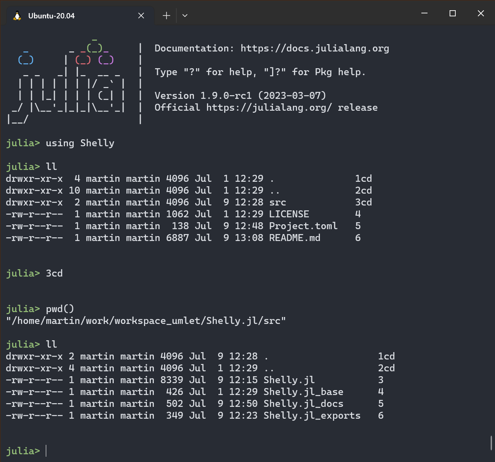
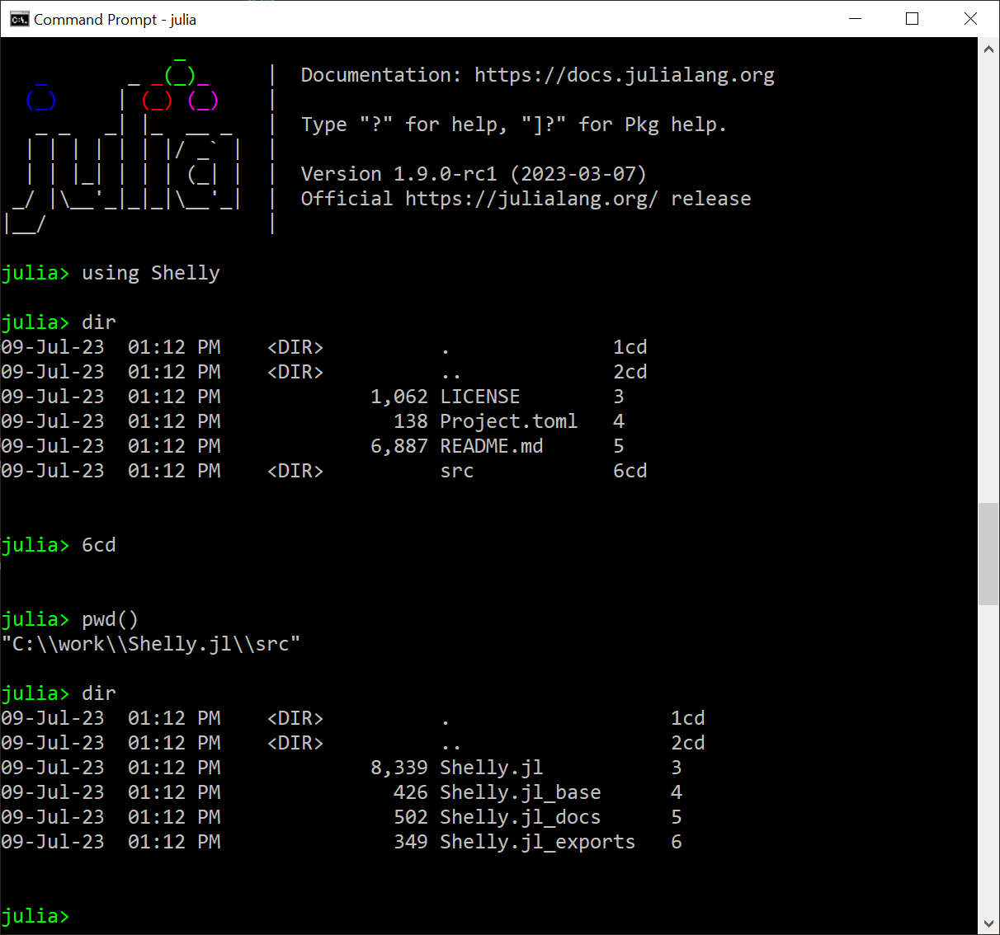

# Shelly.jl: `cd`, `ls`, and `ll` in the Julia REPL Mode (and `dir` on Windows!)

**Surf your file system on Linux:**



<br>
<br>

**Dash through your file system on Windows:**



<br>
<br>
<br>
<br>

Julia's REPL and its modes are superb. They also offer a variety of ways to interact with the underlying file system--the `cd("somedir")` function, a full-blown shell mode, macro capabilities, etc. Yet all involve just a *tiny* bit more typing of (often shifted) chars, or a mode switch.

Shelly provides a modeless and minimal-keystroke way of navigating the file system with `cd`, `ls`, and `ll` (and `dir` on Windows). On Linux, some additional Unix shortcuts are available.

Shelly does not hack the REPL. Instead, it just uses `show` on custom types, and it overloads multiplication in what we humbly designate the *multiply and conquer* paradigm shift. Find out how it works below the examples.

**Install with:**
```
pkg> add https://github.com/umlet/Shelly.jl.git
julia> using Shelly
```
*Or, to avoid name collisions, maybe just selectively `import` the ones you like (e.g., if the name `df` is likely to clash with your differential equations code):*
```
julia> import Shelly: ll, ls
```
*Note: There is no need to import `cd` -- learn why below.*
<br>
<br>
<br>
<br>


## Usage

### Example: `ll`/`ls` and `cd`

Say our current directory is the "Shelly.jl" one:

```
# Note: - we are in Julia's native REPL mode
#       - the output of 'll' here is written directly to the console

julia> ll
drwxr-xr-x  4 martin martin 4096 Jul  1 12:29 .              1cd
drwxr-xr-x 10 martin martin 4096 Jul  1 12:29 ..             2cd
drwxr-xr-x  2 martin martin 4096 Jul  1 12:29 src            3cd
-rw-r--r--  1 martin martin 1062 Jul  1 12:29 LICENSE        4
-rw-r--r--  1 martin martin  138 Jul  9 11:22 Project.toml   5
-rw-r--r--  1 martin martin 5496 Jul  1 12:29 README.md      6
```

We can now, still in the Julia REPL mode, change the current dir to `src` via its index from the `ll` command:

```
julia> 3cd

julia> pwd()                   # the standard Julia function shows:
"/home/martin/Shelly.jl/src"   # we have indeed moved!
```

Let's look around here:

```
julia> ll
drwxr-xr-x 2 martin martin 4096 Jul  1 12:29 .                   1cd
drwxr-xr-x 4 martin martin 4096 Jul  1 12:29 ..                  2cd
-rw-r--r-- 1 martin martin 7488 Jul  1 12:29 Shelly.jl           3
-rw-r--r-- 1 martin martin  426 Jul  1 12:29 Shelly.jl_base      4
-rw-r--r-- 1 martin martin  502 Jul  9 12:50 Shelly.jl_docs      5
-rw-r--r-- 1 martin martin  265 Jul  1 12:29 Shelly.jl_exports   6
```

And now move back up:

```
julia> 2cd

julia> ll
drwxr-xr-x  4 martin martin 4096 Jul  1 12:29 .              1cd
drwxr-xr-x 10 martin martin 4096 Jul  1 12:29 ..             2cd
drwxr-xr-x  2 martin martin 4096 Jul  1 12:29 src            3cd
-rw-r--r--  1 martin martin 1062 Jul  1 12:29 LICENSE        4
-rw-r--r--  1 martin martin  138 Jul  9 11:22 Project.toml   5
-rw-r--r--  1 martin martin 5693 Jul  9 11:25 README.md      6
```

<br>
<br>

The same works with `ls`. To save space and be lighter on the eye, a `°`-suffix instead of `cd` denotes dirs. Both strings work when trying to change directory:

```
julia> ls
1° .  2° ..  3° src  4  LICENSE  5  Project.toml  6  README.md

julia> 3cd
julia> pwd()
"/home/martin/Shelly.jl/src"

julia> 2cd
julia> pwd()
"/home/martin/Shelly.jl"

julia> 3°
julia> pwd()
"/home/martin/Shelly.jl/src"

julia> 2°
julia> pwd()
"/home/martin/Shelly.jl"
```

<br>
<br>

There is even a third, prefix-based way to change dir via `!`:
```
julia> !2   # is same as '2cd' or '2°'
```
(Alas, it seems to be impossible to alias the `!` operator for now..)

<br>
<br>


### Example: `dir` on Windows

```
julia> dir
09-Jul-23  11:44 AM    <DIR>          .              1cd
09-Jul-23  11:44 AM    <DIR>          ..             2cd
09-Jul-23  11:40 AM             1,062 LICENSE        3
09-Jul-23  11:44 AM               138 Project.toml   4
09-Jul-23  11:44 AM             5,870 README.md      5
09-Jul-23  12:12 PM    <DIR>          src            6cd

julia> 6cd

julia> pwd()
"C:\\work\\Shelly.jl\\src"
```

(`ls` and `ll` default to `dir`'s behavior on Linux.)

<br>
<br>


### Example: `cat`, `head`, `tail`, `wc` (Linux-only)

```
julia> ls
1° .  2° ..  3  Shelly.jl  4  Shelly.jl_base  5  Shelly.jl_docs  6  Shelly.jl_exports

julia> 3cat
module Shelly

using Base.Iterators
...
...
```
These would also work:
```
julia> 3head
..
julia> 3tail
..
julia> 3wc
..
```
<br>
<br>


### Example: `df` (Linux-only)

We can show our mounts with the usual `df`:
```
julia> df
/dev/sdb        263174212    8247948 241488108   4% /                      -1cd
tmpfs             6448660          0   6448660   0% /mnt/wsl               -2cd
tools           498750460  172976384 325774076  35% /init                  -3cd
```
To `cd` to a mount, use negative indices:
```
julia> -2cd
```

<br>
<br>


### The short-shortcut `cc`, and Some More Hints

* You don't have to use `ls` before running a `cd` shortcut, especially if you remember the index
* `0cd` goes to your home directory
* `2cd` always means `cd ..` -- but because we want a shortcut for that shortcut, you can use `cc` instead!

<br>
<br>


### One more thing: `ps1`

As you'll gallivant around your file system more promiscuously now, you might want to tune the REPL prompt:

```
julia> ps1
Shelly.jl/::julia>   # the new prompt shows the current dir now
```

<br>
<br>


## How Does it Work?

*   Shortcuts like `ls` and `ll` are simple -- they are just values:
    ```
    struct ShortcutLs <: AbstractShortcut end

    const ls = ShortcutLs()
    ```
    The `Base.show` method calls `Shelly.atshow` for all `AbstractShortcut`s, where the actual `ls` printing takes place:
    ```
    atshow(_::ShortcutLs) = _ls()
    ```
    Note: following the above logic, you can easily define your own shortcuts!

*   Shortcuts that require an argument, like `cd`, work differently.

    First, Julia provides a neat way of parsing multiplication without the `*` operator:
    ```
    julia> x = 21
    julia> 2x
    42
    ```
    If x is of some new, custom type, we can override the multiplication operation:
    ```
    Base.:*(i::Int64, _::SomeNewType) = ...
    ```
    But here we want to use the string `cd`, which is an already-defined Julia function. Luckily, we don't even have to dispatch on functions in general, but we can dispatch on the `cd`s singleton type as seen in:
    ```
    julia> typeof(cd)
    typeof(cd) (singleton type of function cd, subtype of Function)
    ```
    We can thus use:
    ```
    Base.:*(i::Int64, _::typeof(cd)) = ShortcutCd(i)
    ```
    And underneath, the same logic as above is then at work:
    ```
    atshow(x::ShortcutCd) = _cd(x.i)
    ```

<br>
<br>


## Change History

0.8 `dir` on Windows; exports; docstring

0.7 Doc update, dirs listed first on Linux

0.6 Initial version

<br>
<br>


## TODOs
More Windows support; code cleanup; more commands (`pwd`)?; register..

